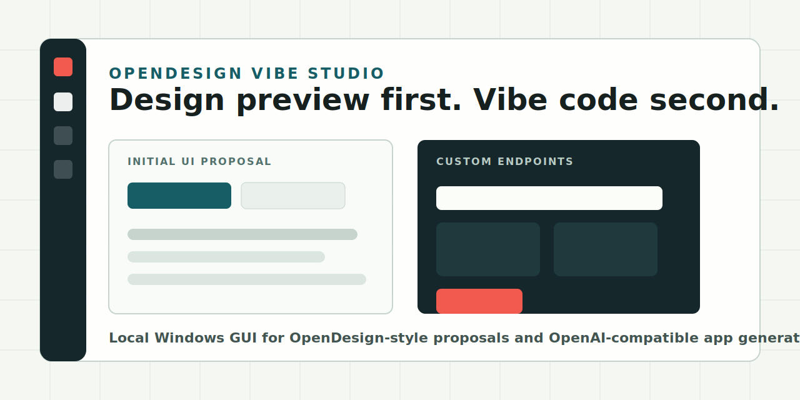

<p align="center">
  
</p>

# OpenDesign Vibe Studio

[](https://github.com/jcrutch-design/opendesign-vibe-studio/actions/workflows/ci.yml)
[](LICENSE)
[](#run)
[](#custom-model-endpoints)

**Design preview first. Vibe code second.**

OpenDesign Vibe Studio is a Windows-first local desktop app that combines an OpenDesign-style proposal workflow with custom OpenAI-compatible LLM endpoints. It creates a visual UI proposal before code generation, then writes the generated functional app into a local project folder.

If this project helps your local AI app-building workflow, a star helps other builders find it.

## Why This Exists

Most vibe-coding tools jump straight from prompt to code. OpenDesign Vibe Studio adds a missing first step: generate a UI proposal you can inspect before asking a model to build the functional app.

It is built for people experimenting with:

- Local LLMs and model routers.
- OpenAI-compatible gateways such as Ollama, LM Studio, LiteLLM, OpenRouter, FreeLLMAPI, and custom endpoints.
- Desktop-first workflows where generated files stay on your machine.
- OpenDesign-style GUI generation and app handoff.

## Features

- Local Electron desktop GUI for Windows.
- Built-in OpenDesign-style proposal pass.
- Initial `opendesign-proposal.html` design preview before app generation.
- Custom endpoint manager with endpoint URL, API key, model name, and optional headers.
- OpenAI-compatible `/v1/chat/completions` support.
- Automatic normalization of base `/v1` endpoints.
- Project creation/import with local file output.
- Generated file manifest, code viewer, and local `index.html` preview.
- Vibe coding progress indicator.
- Resizable project rail for more design-preview space.
- Configurable external OpenDesign command for users with a real CLI.

## Workflow

```text
Write app brief
  -> Run OpenDesign
  -> Inspect UI proposal
  -> Vibe code with selected endpoint
  -> Review generated files
  -> Preview local app
```

## Run

```powershell
npm install
npm run dev
```

If Electron was installed without its binary, run:

```powershell
node .\node_modules\electron\install.js
```

Then start again:

```powershell
npm run dev
```

## Build

```powershell
npm run build
npm run dist
```

## Custom Model Endpoints

OpenDesign Vibe Studio works with OpenAI-compatible chat-completions endpoints. Examples:

```text
http://127.0.0.1:11434/v1/chat/completions
http://127.0.0.1:31415/v1
https://openrouter.ai/api/v1/chat/completions
https://your-gateway.example.com/v1/chat/completions
```

If you enter a base endpoint ending in `/v1`, the app automatically calls `/v1/chat/completions`.

## OpenDesign Command

The default command is:

```powershell
builtin:opendesign
```

That built-in mode creates an OpenDesign-style proposal locally. If your OpenDesign install exposes a CLI, change the command in **Models** and use these tokens:

```text
{brief}
{projectPath}
{source}
```

## Roadmap

- Export proposal screenshots.
- Store multiple proposal iterations per project.
- Add model discovery for compatible providers.
- Add packaged Windows releases.
- Add project templates for dashboards, editors, and agent tools.
- Add streaming progress for long code-generation runs.

## Contributing

Issues, ideas, and PRs are welcome. If you try it with a local model router, please open an issue with what worked and what broke.

## License

MIT
